<!-- CYANEX1702 // MATRIX-ANALOG TERMINAL PROFILE // ULTIMATE -->

<div align="center">

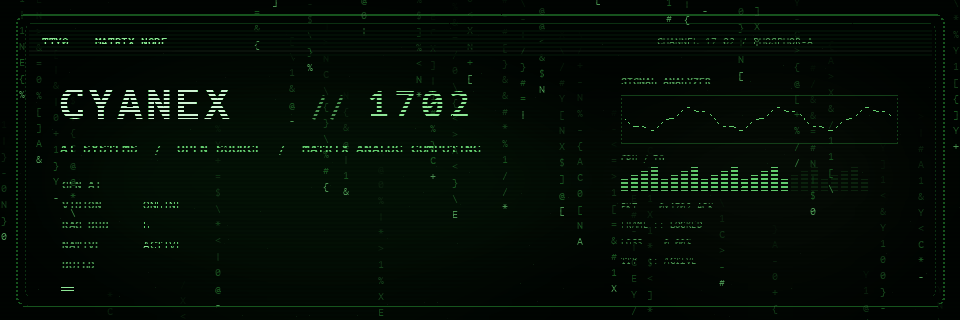

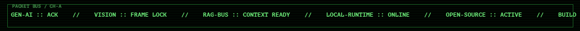

<a href="https://git.io/typing-svg">
  
</a>

<br/>

<a href="#projects"></a>
<a href="#stack"></a>
<a href="#snake"></a>
<a href="#telemetry"></a>
<a href="#topology"></a>

<br/><br/>


</div>

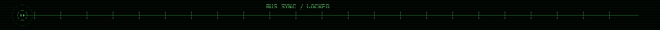

## `> WHOAMI`

```text
USER@GITHUB:~$ WHOAMI
CYANEX1702

USER@GITHUB:~$ UNAME -A
CYANEX1702 17.02 / AI-SYSTEMS / OPEN-SOURCE / MATRIX-ANALOG

USER@GITHUB:~$ CAT /ETC/PROFILE
NODE      :: CYANEX1702
CLASS     :: AI / SOFTWARE BUILDER
FOCUS     :: GENERATIVE_AI | VISION | RAG | LOCAL_AI
MODE      :: RESEARCH -> PRODUCT
STATE     :: ONLINE
```

> **THE MODEL IS ONE COMPONENT. THE SYSTEM IS THE THING THAT MATTERS.**

<details open>
<summary><b>&gt; NEOFETCH</b></summary>
<br/>

<div align="center">
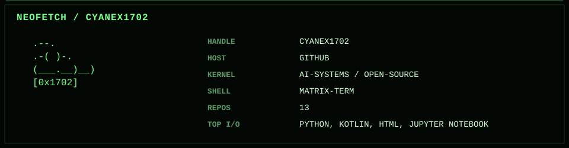
</div>

</details>

<details>
<summary><b>&gt; OPEN /ETC/MOTD</b></summary>
<br/>

```text
WELCOME TO NODE 17.02

NO CORPORATE-PERSONA PACKAGE DETECTED.
NO "10X NINJA ROCKSTAR" MODULE INSTALLED.

CURRENT PROCESS:
    BUILD SYSTEMS THAT LEAVE THE NOTEBOOK,
    SURVIVE REAL INPUTS,
    AND REMAIN UNDERSTANDABLE WHEN SOMETHING BREAKS.

CTRL+C IS NOT A STRATEGY.
```

</details>

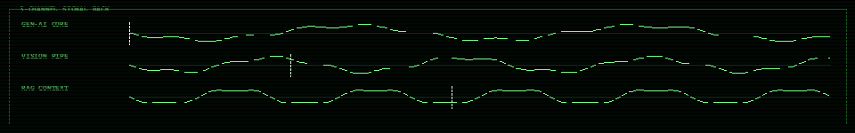

---

<a id="projects"></a>

## `> LS ./PROJECTS --FEATURED`

<details open>
<summary><b>[01] OPENFRAME // LOCAL-FIRST AI CREATIVE STUDIO</b></summary>
<br/>

[](https://github.com/Cyanex1702/OpenFrame-Open-Source-Desktop-Creative-Studio-AI-Media-Editor)


```text
TYPE      :: DESKTOP CREATIVE SYSTEM
AI        :: LOCAL WHISPER TRANSCRIPTION
MEDIA     :: MULTITRACK + FFMPEG
STACK     :: REACT / TYPESCRIPT / RUST / TAURI
DESIGN    :: LOCAL-FIRST / PRIVACY-ORIENTED / NATIVE
STATE     :: SHIPPING
```

<details>
<summary><b>&gt; PSTREE OPENFRAME</b></summary>
<br/>

```text
OPENFRAME
├── UI
│   ├── MULTITRACK_EDITOR
│   ├── DESIGN_CANVAS
│   └── RECOVERY_STATE
├── AI
│   └── WHISPER_LOCAL
├── NATIVE
│   ├── FFMPEG_PIPELINE
│   └── FILESYSTEM_IO
└── RUNTIME
    ├── TAURI_BRIDGE
    └── DESKTOP_SHELL
```

</details>
</details>

<details>
<summary><b>[02] OMNI // ANDROID MEDIA RUNTIME</b></summary>
<br/>

[](https://github.com/Cyanex1702/Omni)

```text
TYPE      :: ANDROID MEDIA SYSTEM
STACK     :: KOTLIN / MEDIA3 / FFMPEG / YT-DLP
MODE      :: OFFLINE-FIRST
MODULES   :: PLAYBACK / QUEUES / LYRICS / PIP / DOWNLOADS
STATE     :: ACTIVE
```
</details>

<details>
<summary><b>[03] VIRTUAL_TRY_ON // GENERATIVE FASHION + VISION</b></summary>
<br/>

[](https://github.com/Cyanex1702/Virtual_Try_on_FashionGenAi)


```text
GEN       :: STABLE DIFFUSION INPAINTING
VISION    :: U2NET SEGMENTATION
DOMAIN    :: PERSONALIZED FASHION GENERATION
SIGNAL    :: COMMUNITY TRACTION
```
</details>

<details>
<summary><b>[04] RAG // RETRIEVAL CONTEXT BUS</b></summary>
<br/>

[](https://github.com/Cyanex1702/Retrieval-Augmented-Generation-RAG-Using-Hugging-Face-Embeddings)

```text
PIPELINE  :: EMBEDDINGS -> VECTOR SEARCH -> CONTEXT -> GENERATION
STACK     :: HUGGING FACE / CHROMADB / LLMS
FOCUS     :: SEMANTIC RETRIEVAL / GROUNDED GENERATION
```
</details>

<details>
<summary><b>[05] IMAGE_SENSEI // DATASET ACQUISITION UTILITY</b></summary>
<br/>

[](https://github.com/Cyanex1702/Image_Scrapping_Toolkit)

```text
TYPE      :: MULTITHREADED IMAGE SCRAPER
FILTERS   :: DUPLICATES / TEXT-HEAVY IMAGES
OUTPUT    :: NORMALIZED CV-READY DATASETS
```
</details>

<details>
<summary><b>[06] GRIMOIRE // OFFLINE-FIRST ANDROID SYSTEM</b></summary>
<br/>

[](https://github.com/Cyanex1702/Grimoire)

```text
STACK     :: KOTLIN / JETPACK COMPOSE / SQLITE
FEATURES  :: BUDGETS / REPORTS / EXPORTS / VOICE / BIOMETRICS
MODE      :: NATIVE + OFFLINE-FIRST
```
</details>


<a id="stack"></a>

## `> LSHW --CYANEX`

<div align="center">
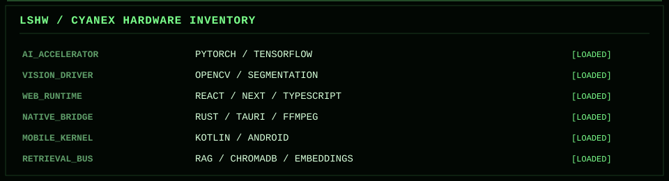
</div>

<details>
<summary><b>&gt; CAT /PROC/STACK/MENTAL_MODEL</b></summary>
<br/>

```text
AI / ML
├── GENERATIVE SYSTEMS
├── MULTIMODAL WORKFLOWS
├── COMPUTER VISION
├── RETRIEVAL / RAG
└── LOCAL INFERENCE

SOFTWARE
├── DESKTOP APPLICATIONS
├── ANDROID
├── NATIVE MEDIA PROCESSING
├── OPEN-SOURCE TOOLING
└── DATA PIPELINES

OPERATING RULE
└── BUILD BEYOND THE DEMO
```
</details>

---

<a id="snake"></a>

## `> ./SNAKE.DAEMON --LIVE`

<div align="center">

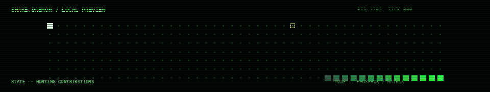

<br/>

<picture>
  <source media="(prefers-color-scheme: dark)" srcset="./assets/github-snake-dark.svg" />
  <source media="(prefers-color-scheme: light)" srcset="./assets/github-snake.svg" />
  
</picture>

<sub>`LOCAL SNAKE.DAEMON + LIVE CONTRIBUTION SNAKE // GENERATED BY GITHUB ACTIONS`</sub>

</div>

---

## `> ./MATRIX-MEMORY --CONTRIBUTIONS`

<div align="center">
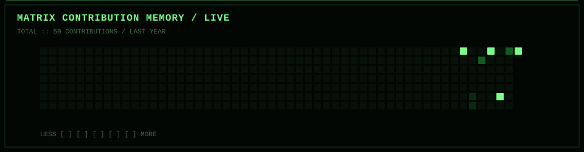
</div>

---

<a id="telemetry"></a>

## `> ./TELEMETRY --LIVE`

<div align="center">
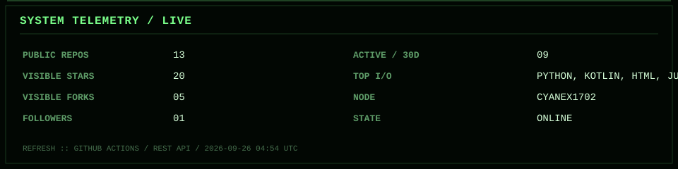
</div>

<details open>
<summary><b>&gt; CAT /VAR/LOG/LAST_PACKET</b></summary>
<br/>
<div align="center">
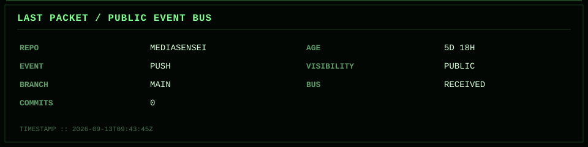
</div>
</details>

---

<a id="topology"></a>

## `> NETSTAT --TOPOLOGY`

<div align="center">
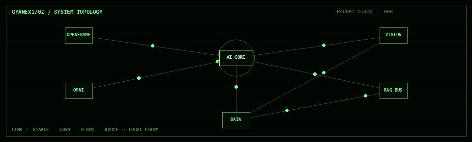
</div>

```text
AI CORE
├── OPENFRAME     :: LOCAL AI + DESKTOP MEDIA
├── OMNI          :: ANDROID + NATIVE MEDIA
├── VISION        :: GENERATIVE VISION / TRY-ON
├── RAG BUS       :: RETRIEVAL + CONTEXT
└── DATA          :: SCRAPING + DATASET ENGINEERING
```

---

## `> MAN CYANEX1702`

<details>
<summary><b>CYANEX1702(1) // USER COMMANDS</b></summary>
<br/>

```text
NAME
    CYANEX1702 - BUILDS QUESTIONABLE AMOUNTS OF SOFTWARE
                THROUGH TERMINAL-SHAPED INTERFACES.

SYNOPSIS
    CYANEX1702 [--BUILD] [--BREAK] [--REBUILD] [--SHIP]

DESCRIPTION
    OPERATES ACROSS GENERATIVE AI, COMPUTER VISION,
    RETRIEVAL, LOCAL AI, DESKTOP SYSTEMS, AND ANDROID.

OPTIONS
    --BUILD
        TURN AN IDEA INTO A RUNNING SYSTEM.

    --BREAK
        DISCOVER WHAT THE HAPPY PATH WAS HIDING.

    --REBUILD
        REMOVE THE PART THAT SHOULD NOT HAVE EXISTED.

    --SHIP
        RELEASE BEFORE ANOTHER REWRITE BECOMES TEMPTING.

BUGS
    PROBABLY.

FILES
    /DEV/GENERATIVE_AI
    /DEV/VISION_BUS
    /VAR/LOG/CYANEX1702
    /HOME/CYANEX1702/PROJECTS

SEE ALSO
    GIT(1), PYTHON(1), RUST(1), KOTLIN(1), CAFFEINE(8)
```

</details>

---

## `> TAIL -F /VAR/LOG/CYANEX1702/CURRENT.LOG`

```python
CYANEX1702 = {
    "AI": [
        "GENERATIVE SYSTEMS",
        "MULTIMODAL WORKFLOWS",
        "COMPUTER VISION",
        "RAG",
        "LOCAL AI",
    ],
    "SOFTWARE": [
        "DESKTOP SYSTEMS",
        "ANDROID",
        "NATIVE MEDIA PROCESSING",
        "OPEN-SOURCE TOOLING",
    ],
    "RULE": "BUILD BEYOND THE DEMO",
}

while ONLINE:
    BUILD()
    TEST()
    BREAK_THINGS()
    IMPROVE()
    SHIP()
```

<details>
<summary><b>&gt; SUDO REVEAL-HIDDEN-MESSAGE</b></summary>
<br/>

```text
PERMISSION GRANTED.

IF YOU OPENED EVERY COLLAPSIBLE PROCESS,
YOU ARE EXACTLY THE KIND OF PERSON
THIS PROFILE WAS BUILT FOR.

SIGNAL-ID  :: 0x1702
CARRIER    :: STABLE
TERMINAL   :: STILL ALIVE
```

</details>

<div align="center">


```text
NO CARRIER?  NEVER.
CYANEX1702 :: TERMINAL STILL ACTIVE
```

<a href="https://github.com/Cyanex1702?tab=repositories">
  
</a>

</div>
